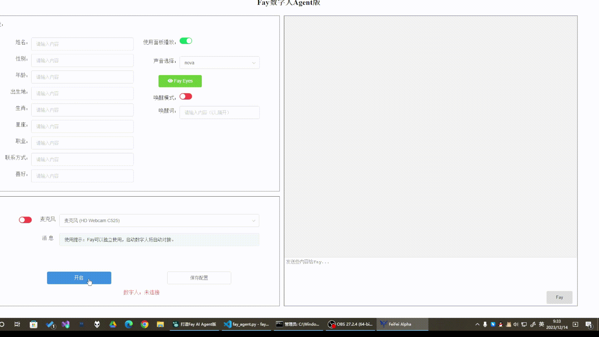

[`English`](https://github.com/TheRamU/Fay/blob/main/README_EN.md)

<div align="center">
    <br>
    
    <h1>Fay数字人 AI Agent版</h1>
    “agent”即代理，它能够代替你完成决策规划并执行，这一切都依赖目前最强的大语言模型的ReAct能力。不同于助理版的一问一答，agent版的Fay可以实现自动代理执行的同时，在它认为必要时候会触发数字人或者直接的声音输出。
</div>


**12月迟来的报到，Fay数字人 AI Agent版（含智慧农业箱的操作demo代码，如果你需要完整代码可以公众号留言申请获取）第4版正式上传！**

如果你需要是一个线上线下的销售员，请移步[`带货完整版`](https://github.com/TheRamU/Fay/tree/fay-sales-edition)                       

如果你需要的是一个人机交互的数字人助理（当然，你也可以命令它开关设备），请移步 [`助理完整版`](https://github.com/TheRamU/Fay/tree/fay-assistant-edition)


***“优秀的产品都值得用数字人从新做一遍”***

亮点：计划任务主动执行，无需一问一答，自动规划及调用agent tool去完成工作；使用open ai tts；使用向量数据库实现永久记忆及记忆检索；



​                                                                       (上图：实测ReAct能力）

## **安装说明**


### **环境要求** 

- Python 3.9、3.10
- Windows、macos、linux

### **安装依赖**

```shell
pip install -r requirements.txt
```

### **配置应用密钥**

+ 将GPT-4 key填入 `./system.conf` 中

### **启动控制器**

启动Fay控制器

```shell
python main.py
```

### **启动数字人（非必须）**

+ 启动数字人[xszyou/fay-ue5: 可对接fay数字人的ue5工程 (github.com)](https://github.com/xszyou/fay-ue5)

  

### **联系**

**商务QQ: 467665317**

**进交流群**关注公众号 **fay数字人**（**请先star本仓库**）


