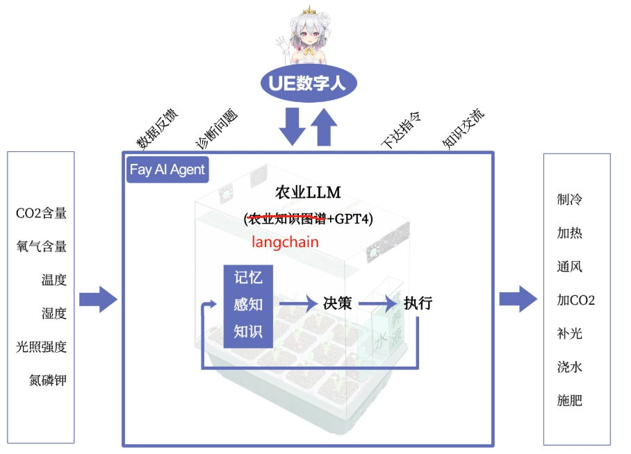

[`English`](https://github.com/TheRamU/Fay/blob/main/README_EN.md)

     
    
    <h1>Fay数字人 AI Agent版</h1>

[`带货完整版`](https://github.com/TheRamU/Fay/tree/fay-sales-edition)                        [`助理完整版`](https://github.com/TheRamU/Fay/tree/fay-assistant-edition)

***“优秀的产品都值得用数字人从新做一遍”***

**10月，Fay数字人 AI Agent版与官方demo(实验箱)同时开源！**
**目前进展**

一、APP载入UE数字人：
1、像素流服务搭建及优化：
已经完成，上线时会同步开放代码

2、UE音频流插件：
正在调试修复Bug.

3、改进BS唇型：
进行中.

二、智慧农业箱硬件改造：
完成并已经稳定运行，上线时会公布硬件设计图.

三、IOTM3.0及Raspberry逻辑修改：
完成并已经稳定运行，上线时会同步开放代码.

四、农业LLM：
已经搭建农业知识图谱。
开始测试gpt4的设备控制的推理能力:已经完成硬件控制规则的自动初始化及控制逻辑的自动修正测试.

五、Fay控制器适应新版：
未开始

​                                                                       (上图：Fay数字人智慧农业实验箱）

**高校老师请联系，我们团队将协助你课程落地，输出《人才培养方案》！**

### **联系**

**商务QQ: 467665317**

**进交流群**关注公众号 **fay数字人**（**请先star本仓库**）

