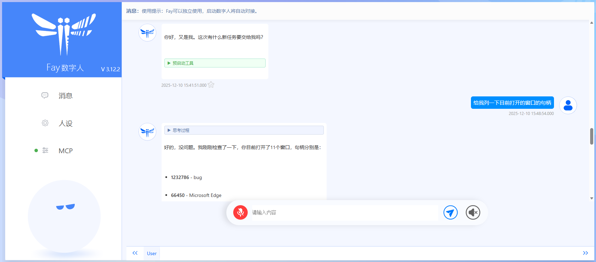
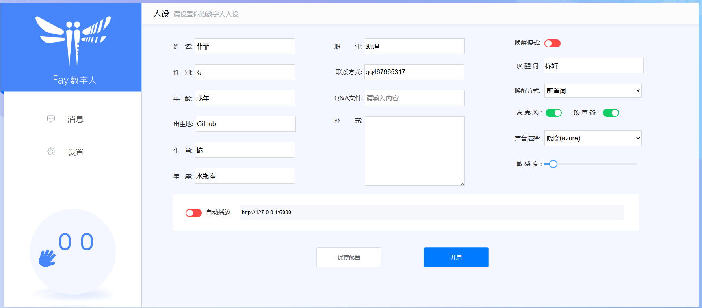
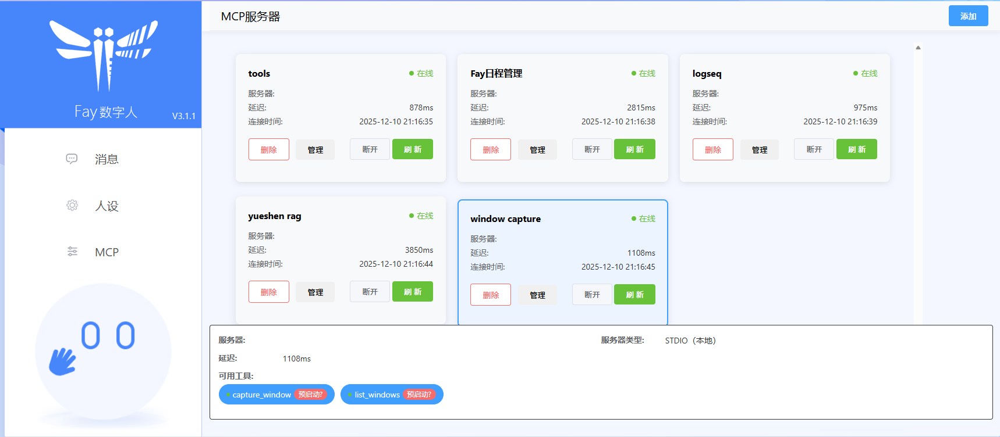

<div align="center">
    <br>
    
    <h1>FAY</h1>
	<h3>Fay数字人框架</h3>
</div>

！！重要通知：我们已经把Fay的三个版本合并成1个，并致力提供更稳定更全面的功能。

我们致力于思考面向终端的数字人落地应用，并通过完整代码把思考结果呈现给大家。Fay数字人框架，向上适配各种数字人模型技术，向下接入各式大语言模型，并且便于更换诸如TTS、ASR等模型，为单片机、app、网站提供全面的数字人应用接口。      
更新日志：https://qqk9ntwbcit.feishu.cn/wiki/UlbZwfAXgiKSquk52AkcibhHngg
文档：https://qqk9ntwbcit.feishu.cn/wiki/JzMJw7AghiO8eHktMwlcxznenIg


## **功能特点**


- 完全开源，商用免责
- 支持全离线使用
- 全时流式的支持
- 自由匹配数字人模型、大语言模型、ASR、TTS模型
- 支持数字人自动播报模式（虚拟教师、虚拟主播、新闻播报）
- 支持任意终端使用：单片机、app、网站、大屏、成熟系统接入等
- 支持多用户多路并发
- 提供文字交互接口、语音交互接口、数字人驱动接口、管理控制接口、自动播报接口、意图接口
- 支持语音指令灵活配置执行
- 支持自定义知识库、自定义问答对、自定义人设信息
- 支持唤醒及打断对话
- 支持服务器及单机模式
- 支持机器人表情输出
- 支持react agent自主决策执行、主动对话（准备升级到MCP协议）
- 支持后台静默启动
- 支持deepseek等thinking llm
- 设计独特的认知模型
- 支持MCP
- 提供配置管理中心

###               

## **Fay数字人框架**








## **源码启动**


### **环境** 
- Python 3.12
- Windows、macos、linux

### **安装依赖**

```shell
pip install -r requirements.txt
```

### **配置**
+ 依照说明修改 `./system.conf` 文件

### **启动**
启动Fay控制器
```shell
python main.py
```


## **或docker 启动**

1. 下载助理版
https://github.com/xszyou/Fay
2.  修改 `./system.conf` 文件
3. 删除requirements.txt下pyqt5~=5.15.6

build （修改配置文件后，需要重新build）
```shell
docker build  -t fay ./fay-assistant-edition
```
run
```shell
docker run -it --rm -p 5000:5000 -p 10001:10001 -p 10002:10002 -p 10003:10003 fay
```


## **高级玩法**


### ***使用数字人（非必须）***

ue: https://github.com/xszyou/fay-ue5

unity：https://qqk9ntwbcit.feishu.cn/wiki/Se9xw04hUiss00kb2Lmci1BVnM9

metahuman-stream（2d）：https://qqk9ntwbcit.feishu.cn/wiki/Ik1kwO9X5iilnGkFwRhcnmtvn3e

duix（android)：https://qqk9ntwbcit.feishu.cn/wiki/Ik1kwO9X5iilnGkFwRhcnmtvn3e()

aibote(windows cpu克隆人)：[‬‍‬‍⁠‍‍‍‌https://qqk9ntwbcit.feishu.cn/wiki/ULaywzVRti0HXWkhCzacoSPAnIg


### ***集成到自家产品（非必须）***
接口：https://qqk9ntwbcit.feishu.cn/wiki/Mcw3wbA3RiNZzwkexz6cnKCsnhh


### **联系**

**交流群及资料教程**关注公众号 **fay数字人**（**请先star本仓库**）


