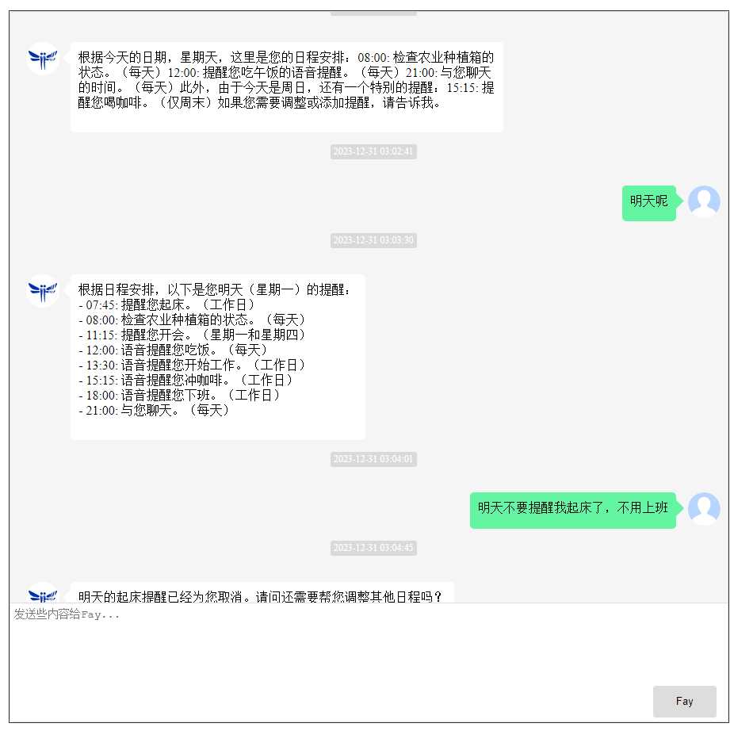
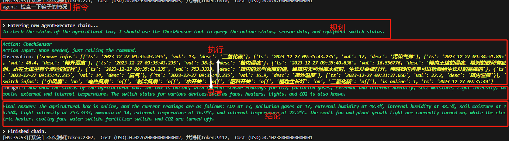
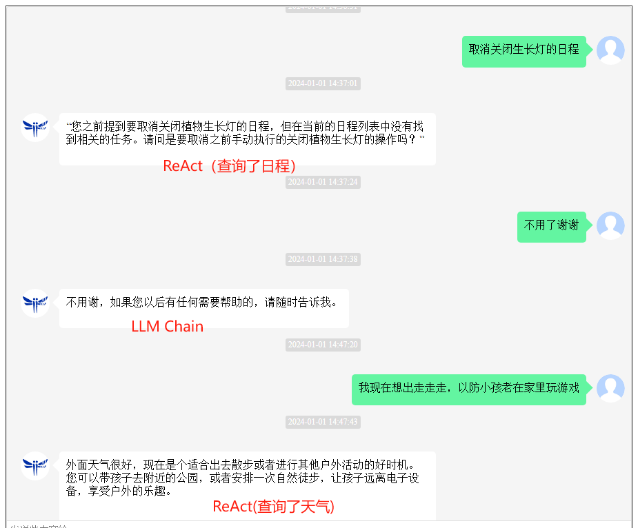
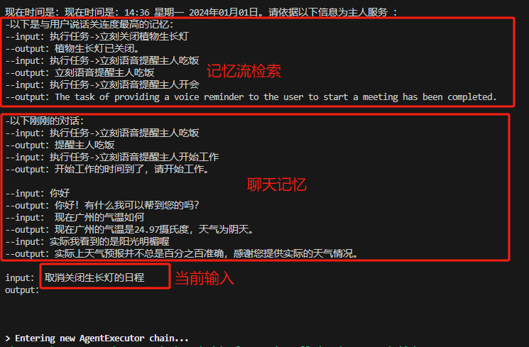
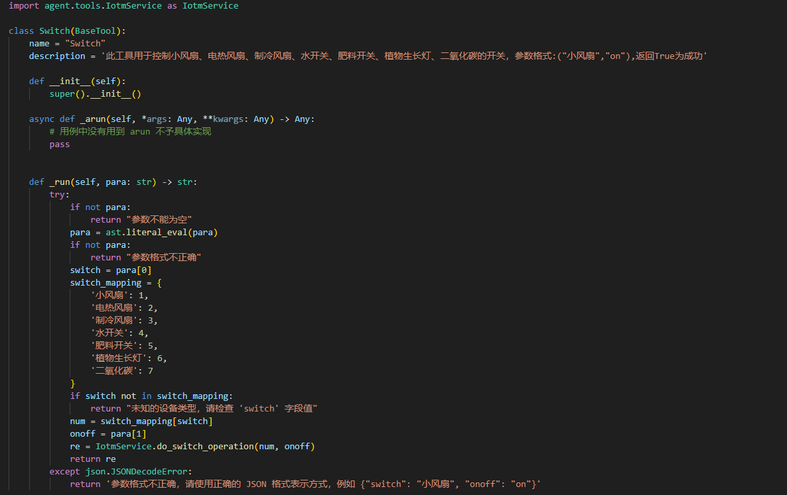

[`English`](https://github.com/TheRamU/Fay/blob/main/README_EN.md)

<div align="center">
    <br>
    
    <h1>Fay数字人 AI Agent版</h1>
    “agent”即代理，它能够代替你完成决策规划并执行，这一切都依赖目前最强的大语言模型的ReAct能力。不同于助理版的一问一答，agent版的Fay可以实现自动代理执行的同时，在它认为必要时候会触发数字人或者直接的声音输出。
</div>


**请先想明白**

如果你需要是一个线上线下的销售员，请移步[`带货完整版`](https://github.com/TheRamU/Fay/tree/fay-sales-edition)                       

如果你需要的是一个人机交互的数字人助理（当然，你也可以命令它开关设备），请移步 [`助理完整版`](https://github.com/TheRamU/Fay/tree/fay-assistant-edition)


***然后，“优秀的产品都值得用数字人从新做一遍”***
1、基于日程维护的助理模式：执行及维护你的日程，绝不是一个简单的闹钟


2、强大的规划执行（ReAct）能力：规划->执行<->反思->总结


3、LLM Chain与React Agent自动切换：保留规划执行能力的同时兼顾聊天能力（还需优化）


4、双记忆机制：斯坦福AI小镇的记忆流（时间、重要性、相关度）实现长时记忆，邻近对话记忆实现连贯对话


5、易于扩展的agent 工具


6、配套24小时后台运行的android 连接器


## **安装说明**


### **环境要求** 

- Python 3.9、3.10
- Windows、macos、linux

### **安装依赖**

```shell
pip install -r requirements.txt
```

### **配置应用密钥**

+ 将GPT-4 key填入 `./system.conf` 中

### **启动控制器**

启动Fay控制器

```shell
python main.py
```

### **启动数字人（非必须）**

+ 仓库地址：https://github.com/xszyou/fay-ue5

### **启动android 连接器（非必须）**

+ 仓库地址：https://github.com/xszyou/fay-android

### **更新日志**
2024.01.01:
openai token计算✓
优化ReAct Agent 与 LLM Chain自动切换逻辑✓
*添加双记忆机制：长时记忆流及短时聊天记忆✓
修复record.py asr bug✓
提高远程音频（android 连接器）的稳定性✓
修复执行时间计算bug✓
优化语音输出逻辑✓

2023.12.25:

*实现agent ReAct与LLM chain自动切换逻辑✓
聊天窗区分任务消息✓
修复删除日程bug✓
优化远程音频逻辑✓
等待处理引入加载中效果✓
优化prompt以解决日程任务递归调用问题✓
修复一次性日程清除的bug✓


### **技术交流**


