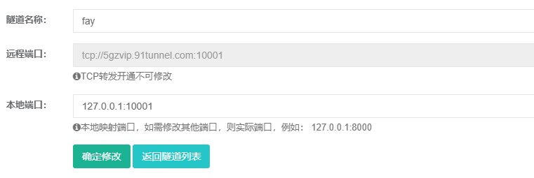
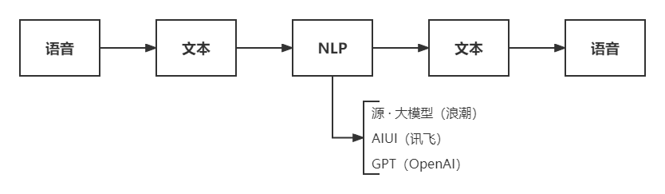

<div align="center">
    <br>
    
    <h1>FAY</h1>
	<h3>数  字  人  Fay  控  制  器(这是元宇宙吗？)</h3>
</div>


Fay是一个完整的开源项目，包含Fay控制器及数字人模型，可灵活组合出不同的应用场景：虚拟主播、现场推销货、商品导购、语音助理、远程语音助理、数字人互动、数字人面试官及心理测评、贾维斯、Her。开发人员可以利用该项目简单地构建各种类型的数字人或数字助理。该项目各模块之间耦合度非常低，包括声音来源、语音识别、情绪分析、NLP处理、情绪语音合成、语音输出和表情动作输出等模块。每个模块都可以轻松地更换。

## **一、Fay控制器用途**


### **远程语音助理**   [`PC demo`](https://github.com/TheRamU/Fay/tree/main/python_connector_demo)

### **远程语音助理**  [`android demo`](https://github.com/TheRamU/Fay/tree/main/android_connector_demo)


### **与数字形象通讯**（非必须,控制器需要关闭“面板播放”）

控制器与采用 WebSocket 方式与 UE 通讯


下载工程: [https://pan.baidu.com/s/1RBo2Pie6A5yTrCf1cn_Tuw?pwd=ck99](https://pan.baidu.com/s/1RBo2Pie6A5yTrCf1cn_Tuw?pwd=ck99)


下载windows运行包: [https://pan.baidu.com/s/1CsJ647uV5rS2NjQH3QT0Iw?pwd=s9s8](https://pan.baidu.com/s/1CsJ647uV5rS2NjQH3QT0Iw?pwd=s9s8)


**发您的Fay运行效果视频至公众号领取最新的UE5模型哦**

通讯地址: [`ws://127.0.0.1:10002`](ws://127.0.0.1:10002)（已接通）

消息格式: 查看 [WebSocket.md](https://github.com/TheRamU/Fay/blob/main/WebSocket.md)


### **与远程音频输入输出设备连接**（非必须,外网需要配置http://ngrok.cc tcp通道的clientid）

控制器与采用 socket(非websocket) 方式与 音频输出设备通讯

内网通讯地址: [`ws://127.0.0.1:10001`](ws://127.0.0.1:10001)

外网通讯地址: 通过http://ngrok.cc获取（有伙伴愿意赞助服务器给社区免费使用吗？）


消息格式: 参考 [remote_audio.py](https://github.com/TheRamU/Fay/blob/main/python_connector_demo/remote_audio.py)


## **二、Fay控制器核心逻辑**



 **注：**

1、去API及会话管理功能将在下一版本发布；

2、以上每个模块可轻易替换成自家核心产品。

### **目录结构**

```
.
├── main.py					# 程序主入口
├── fay_booter.py			# 核心启动模块
├── config.json				# 控制器配置文件
├── system.conf				# 系统配置文件
├── ai_module
│   ├── ali_nls.py			# 阿里云 实时语音
│   ├── ms_tts_sdk.py       # 微软 文本转语音
│   ├── xf_aiui.py          # 讯飞 人机交互-自然语言处理
│   ├── chatgpt.py          # gpt3.5对接
│   ├── yuan_1_0.py          # 浪潮.源大模型对接
│   └── xf_ltp.py           # 讯飞 性感分析
├── bin                     # 可执行文件目录
├── core                    # 数字人核心
│   ├── fay_core.py         # 数字人核心模块
│   ├── recorder.py         # 录音器
│   ├── tts_voice.py        # 语音生源枚举
│   ├── viewer.py           # 抖音直播间接入模块
│   └── wsa_server.py       # WebSocket 服务端
├── gui                     # 图形界面
│   ├── flask_server.py     # Flask 服务端
│   ├── static
│   ├── templates
│   └── window.py           # 窗口模块
├── scheduler
│   └── thread_manager.py   # 调度管理器
└── utils                   # 工具模块
    ├── config_util.py      
    ├── storer.py
    └── util.py
```


## **三、升级日志**

**2023.04：**

+ 抖音直播互动数据对接更换成系统代理抓包pd解码的方式（运行直播伴侣即可）；
+ 修复若干逻辑及说明错误。


**2023.03：**

+ 增加edge-tts语音合成（免费）可替换azure-tts(支持情绪化语音)；
+ 替换flask发行版运行方式；
+ web socket接口增加数字人文字内容同步，以便数人字可以远程运行；
+ 优化数字人数据web socket同步逻辑；
+ 更改gpt 3.5对接方式。

**2023.02：**

+ 提供chatgpt及yuan1.0作为选择。

**2023.01：**

+ 控制器pc内网穿透，音频输入输出设备远程直连；
+ 提供android 音频输入输出工程示例代码；
+ 提供python音频输入输出工程示例代码（远程PC、树莓派等可用）；
+ 补传1.0语音指令音乐播放模块（暂不支持远程播放）；
+ 重构及补充若干工具模块：websocket、多线程、缓冲器、音频流录制器等；
+ 修复1.x版本的多个bug；
+ 集成看板娘;

**2022.12：**

+ 上传bin目录（用于直播互动）；

**2022.11：**

+ 更新抖音直播获取粉丝互动数据的xpath;

**2022.10.27：**

+ 更新mac上的麦克风参数；
+ 解决mac上无法重启问题；
+ 上传brew安装脚本。

**2022.10.17：**
+ 更新语音指令；
+ 补充人设语法；


## **四、安装说明**


### **环境** 
- Python 3.8.0 +
- Chrome 浏览器 (若不开启直播功能，可跳过)

### **安装依赖**

```shell
pip install -r requirements.txt
```

### **配置应用密钥**
+ 查看 [AI 模块](#ai-模块)
+ 浏览链接，注册并创建应用，将应用密钥填入 `./system.conf` 中

### **启动**
启动Fay控制器
```shell
python main.py
```


### **AI 模块**
启动前需填入应用密钥

| 代码模块                  | 描述                       | 链接                                                         |
| ------------------------- | -------------------------- | ------------------------------------------------------------ |
| ./ai_module/ali_nls.py    | 阿里云 实时语音识别        | https://ai.aliyun.com/nls/trans                              |
| ./ai_module/ms_tts_sdk.py | 微软 文本转情绪语音（可选）   | https://azure.microsoft.com/zh-cn/services/cognitive-services/text-to-speech/ |
| ./ai_module/xf_ltp.py     | 讯飞 情感分析              | https://www.xfyun.cn/service/emotion-analysis                |
| ./utils/ngrok_util.py     | ngrok.cc 外网穿透（可选）  | http://ngrok.cc                                              |
| ./ai_module/yuan_1_0.py    | 浪潮源大模型（NLP 3选1）  | https://air.inspur.com/                                              |
| ./ai_module/chatgpt.py     | ChatGPT（NLP 3选1）  | *******                                              |
| ./ai_module/xf_aiui.py    | 讯飞自然语言处理（NLP 3选1）   | https://aiui.xfyun.cn/solution/webapi                        |


## **五、使用说明**


### **使用说明**

+ 抖音虚拟主播：fay控制器（抖音输入源开启、展板播放关闭）+ 数字人 + 抖音伴侣；
+ 现场推销货：fay控制器（展板播放关闭、填写商品信息）+ 数字人；
+ 商品导购：fay控制器（麦克风输入源开启、展板播放关闭、填写商品信息、填写商品Q&A）+ 数字人；
+ 语音助理：fay控制器（麦克风输入源开启、展板播放开启）；
+ 远程语音助理：fay控制器（展板播放关闭）+ 远程设备接入；
+ 数字人互动：fay控制器（麦克风输入源开启、展板播放关闭、填写性格Q&A）+ 数字人；
+ 数字人面试官及心理测评：联系免费领取；
+ 贾维斯、Her：加入我们一起完成。


### **语音指令**

- **关闭核心**
  关闭
  再见
  你走吧
- **静音**
  静音
  闭嘴
  我想静静
- **取消静音**
  取消静音
  你在哪呢？
  你可以说话了
- **播放歌曲**（网易音乐库不可用，寻找替代中）
  播放歌曲
  播放音乐
  唱首歌
  放首歌
  听音乐
  你会唱歌吗？
- **暂停播放**
  暂停播放
  别唱了
  我不想听了


### **图形界面**


### **人设**
数字人属性，与用户交互中能做出相应的响应。
#### 交互灵敏度
在交互中，数字人能感受用户的情感，并作出反应。最直的体现，就是语气的变化，如 开心/伤心/生气 等。
设置灵敏度，可改变用户情感对于数字人的影响程度。

### **接收来源**

#### 抖音

填入直播间地址，实现与直播间粉丝交互

#### 麦克风

选择麦克风设备，实现面对面交互，成为你的伙伴

#### socket远程音频输入

可以接入远程音频输入，远程音频输出


#### 商品栏

填入商品介绍，数字人将自动讲解商品。

当用户对商品有疑问时，数字人可自动跳转至对应商品并解答问题。

配合抖音接收来源，实现直播间自动带货。


### 相关文章：

1、[(34条消息) 非常全面的数字人解决方案_郭泽斌之心的博客-CSDN博客_数字人算法](https://blog.csdn.net/aa84758481/article/details/124758727)

2、[(34条消息) Fay数字人开源项目在mac 上的安装办法_郭泽斌之心的博客-CSDN博客](https://blog.csdn.net/aa84758481/article/details/127551258)

3、【开源项目：数字人FAY——Fay新架构使用讲解】 https://www.bilibili.com/video/BV1NM411B7Ab/?share_source=copy_web&vd_source=64cd9062f5046acba398177b62bea9ad

4、【开源项目FAY——UE工程讲解】https://www.bilibili.com/video/BV1C8411P7Ac?vd_source=64cd9062f5046acba398177b62bea9ad

5、m1机器安装办法（Gason提供）：https://www.zhihu.com/question/437075754


二次开发指导联系QQ 467665317

关注公众号获取最新微信技术交流群二维码


