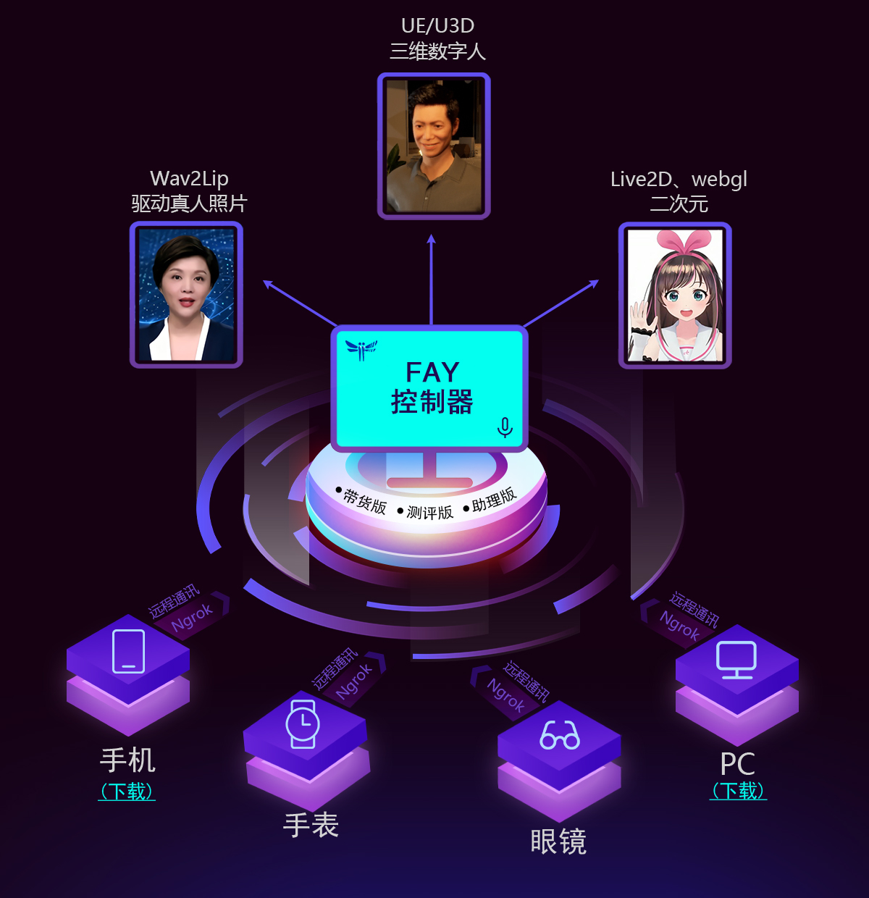

[`English`](https://github.com/TheRamU/Fay/blob/main/README_EN.md)

<div align="center">
    <br>
    
    <h1>FAY</h1>
	<h3>Fay数字人助理</h3>
</div>


Fay数字人助理版是fay开源项目的重要分支，专注于构建智能数字助理的开源解决方案。它提供了灵活的模块化设计，使开发人员能够定制和组合各种功能模块，包括情绪分析、NLP处理、语音合成和语音输出等。Fay数字人助理版为开发人员提供了强大的工具和资源，用于构建智能、个性化和多功能的数字助理应用。通过该版本，开发人员可以轻松创建适用于各种场景和领域的数字人助理，为用户提供智能化的语音交互和个性化服务。


## **Fay数字人助理版**

注：带货版移到分支[`fay-sales-edition`](https://github.com/TheRamU/Fay/tree/fay-sales-edition)


助理版Fay控制器使用：语音沟通，语音和文字回复；文字沟通，文字回复;对接UE、live2d、xuniren，需关闭面板播放。


## **二、Fay助理版**


  Remote Android　　　　　　Local PC　　　　　Remote PC

　　　　　└─────────────┼─────────────┘
                
                
　　　　　　Aliyun API ─┐　　　│
      
            
　　　　　 　　　　　　├── ASR　　　
            
            
 　  　　 　　　 [FunASR](https://www.bilibili.com/video/BV1qs4y1g74e) ─┘  　　  │　　 　 ┌─ Yuan 1.0
                
　　　　　　　　　　　　　　　│　　 　 ├─ [LingJu](https://www.bilibili.com/video/BV1NW4y1D76a/)
                
　　　 　　　　　　　　　　　NLP ────┼─ [GPT/ChatGPT](https://www.bilibili.com/video/BV1Dg4y1V7pn)
                
　　　　　　　　　　　　　　　│　　 　 ├─ [Rasa+ChatGLM-6B](https://www.bilibili.com/video/BV1D14y1f7pr)
         
　　　　　　　　 Azure ─┐　 　 │　　 　 ├─ [VisualGLM](https://www.bilibili.com/video/BV1mP411Q7mj)
            
　　　　　 　 Edge TTS ─┼──     TTS 　  　 └─ [RWKV](https://www.bilibili.com/video/BV1yu41157zB)
       
　 　　 　   　　[开源 TTS](https://www.bilibili.com/read/cv25192534) ─┘　  　│　　 　 
            
　　　　　　　　　　　　　　　│　　 　 
         
　　　　　　　　　　　　　　　│　　 　 
                
　　　  ┌──────────┬────┼───────┬─────────┐

Remote Android　　[Live2D](https://www.bilibili.com/video/BV1sx4y1d775/?vd_source=564eede213b9ddfa9a10f12e5350fd64)　　 [UE](https://www.bilibili.com/read/cv25133736)　　　 [xuniren](https://www.bilibili.com/read/cv24997550)　　　Remote PC


重要：Fay（服务端）与数字人（客户端）的通讯接口: [`ws://127.0.0.1:10002`](ws://127.0.0.1:10002)（已接通）

消息格式: 查看 [WebSocket.md](https://github.com/TheRamU/Fay/blob/main/WebSocket.md)




### ***Code structure***

```
.
├── main.py		    # 程序主入口
├── fay_booter.py	    # 核心启动模块
├── config.json		    # 控制器配置文件
├── system.conf		    # 系统配置文件
├── ai_module
│   ├── ali_nls.py	        # 阿里云 实时语音
│   ├── ms_tts_sdk.py       # 微软 文本转语音
│   ├── nlp_lingju.py       # 灵聚 人机交互-自然语言处理
│   ├── xf_aiui.py          # 讯飞 人机交互-自然语言处理
│   ├── nlp_gpt.py          # gpt api对接
│   ├── nlp_chatgpt.py      # chat.openai.com逆向对接
│   ├── nlp_yuan.py         # 浪潮.源大模型对接
│   ├── nlp_rasa.py         # ChatGLM-6B的基础上前置Rasa会话管理(强烈推荐)
│   ├── nlp_VisualGLM.py    # 对接多模态大语言模型VisualGLM-6B
│   ├── nlp_rwkv.py         # 离线对接rwkv
│   ├── nlp_rwkv_api.py     # rwkv server api
│   ├── yolov8.py           # yolov8资态识别
│   ├── nlp_cemotion.py     # cemotion 情感分析
│   └── xf_ltp.py           # 讯飞 情感分析
├── bin                     # 可执行文件目录
├── core                    # 数字人核心
│   ├── fay_core.py         # 数字人核心模块
│   ├── recorder.py         # 录音器
│   ├── tts_voice.py        # 语音生源枚举
│   ├── authorize_tb.py     # fay.db认证表管理
│   ├── content_db.py       # fay.db内容表管理
│   ├── interact.py         # 互动（消息）对象
│   ├── song_player.py      # 音乐播放（暂不可用）
│   └── wsa_server.py       # WebSocket 服务端
├── gui                     # 图形界面
│   ├── flask_server.py     # Flask 服务端
│   ├── static
│   ├── templates
│   └── window.py           # 窗口模块
├── scheduler
│   └── thread_manager.py   # 调度管理器
├── utils                   # 工具模块
    ├── config_util.py      
    ├── storer.py
    └── util.py
└── test                    # 都是惊喜
```

## **三、升级日志**

**2023.12.04**

+ 接入fastgpt nlp;
+ 修复唇形异常报错的问题;

**2023.11.27**

+ 提高websocket的稳定性；
+ 修复唇形程序路径问题;
+ 提高SQLLITE的稳定性。

**2023.11.20**

+ 唤醒功能优化替换；
+ 增加yolo稳定性;
+ 增加SQLLITE稳定性。


**2023.11.13**

+ 修复配置文件遗漏唤醒词开关参数问题；
+ 修复yolo稳定性问题;
+ 新增音色可供选择。


**2023.11.06**

+ 更新依赖包:cemotion、pydub、flask~=3.0.0；
+ *增加cemotion可选情感分析;
+ 修复讯飞情感分析接口调用bug;
+ 完善保存配置逻辑。

**2023.10.23**

+ 修复一定低概率导致数字人连接状态识别错误问题；
+ *增加唤醒功能

**2023.09.06**

+ 数字人连接提示词修改;
+ Q&A填写demo修复;
+ 安装包错误修复。

**2023.09.01**

+ 修复gpt、chatglm2的消息记录方式逻辑。

**2023.08.30**

+ 调整gpt的消息记录方式;
+ *q&a支持RPA自动化脚本。

**2023.08.23：**

+ 更换gpt对接方式;
+ 增加chatglm2对接。

**2023.08.16：**

+ 优化UE反复重连系统资源占用太高的问题；
+ 自动控制是否启动面板播放；
+ 自动删除运行日志。

**2023.08.09：**

+ 去除mp3格式警告信息；
+ 去除灵聚、渡鸦接口警告信息；
+ websocket逻辑优化；
+ 数字人端接口通讯优化。

**2023.08.04：**

+ UE5工程更新；
+ 唇型计算的视音素更换成33毫秒；
+ 内置rwkv_api nlp可以直接使用；
+ 降低情绪性向数字人端推送的频度；
+ 非数字人连接状态不产生接口消息；
+ 修复因mp3格式错误而导致一定概率不推送播放信息给数字人端的问题；
+ 修复静音等指令执行时提前结束nlp逻辑，而导致用户提问消息不推送数字人端问题；
+ 补充wav文件启动清理；
+ websocket工具类升级完善。

**2023.07：**

+ 增加运行时自动清理ui缓存；
+ 增加gpt代理设置可为空；
+ 提高灵聚对接的稳定性。

+ 修复连接数字人之前产生大量ws信息问题；
+ 增加数字人（ue、live2d、xuniren）通讯接口：实时日志；
+ 更新数字人（ue、live2d、xuniren）通讯接口：音频推送。

+ 带货版多项更新；

+ 修复远程语音不识别问题；
+ 修复asr时有不灵问题；
+ 去除唱歌指令。

+ 修复linux及mac运行出错问题；
+ 修复因唇型出错无法继续执行问题；
+ 提供rwkv对接方案。

+ 修复助理版文字输入不读取人设回复问题；
+ 修复助理版文字输入不读取qa回复问题；
+ 增强麦克风接入稳定性。

+ 修复无法运行唇型算法而导致的不播放声音问题。

**2023.06：**

+ 重构NLP模块管理逻辑，便于自由扩展；
+ gpt：拆分为ChatGPT及GPT、更换新的GPT接口、可单独配置代理服务器；
+ 指定yolov8包版本，解决yolo不兼容问题；
+ 修复：自言自语bug、接收多个待处理消息bug。

+ 集成灵聚NLP api(支持GPT3.5及多应用)；
+ ui修正。

+ 集成本地唇型算法。

+ 解决多声道麦克风兼容问题；
+ 重构fay_core.py及fay_booter.py代码；
+ ui适应布局调整；
+ 恢复声音选择；
+ ”思考中...“显示逻辑修复。

**2023.05：**

+ 修复多个bug：消息框换行及空格问题、语音识别优化；
+ 彩蛋转正，Fay沟通与ChatGPT并行；
+ 加入yolov8姿态识别；
+ 加入VisualGLM-6B多模态单机离线大语言模型。

+ 打出Fay数字人助理版作为主分支（带货版移到分支[`fay-sales-edition`](https://github.com/TheRamU/Fay/tree/fay-sales-edition)）；
+ 添加Fay助理的文字沟通窗口（文字与语音同步）；
+ 添加沟通记录本地保存功能；
+ 升级ChatGLM-6B的应用逻辑，长文本与语音回复分离。


## **四、安装说明**


### **环境** 
- Python 3.9、3.10
- Windows、macos、linux

### **安装依赖**

```shell
pip install -r requirements.txt
```

### **配置应用密钥**
+ 查看 [API 模块](#ai-模块)
+ 浏览链接，注册并创建应用，将应用密钥填入 `./system.conf` 中

### **启动**
启动Fay控制器
```shell
python main.py
```


### **API 模块**
启动前需填入应用密钥

| 代码模块                  | 描述                       | 链接                                                         |
| ------------------------- | -------------------------- | ------------------------------------------------------------ |
| ./ai_module/ali_nls.py    | 实时语音识别（可选）   | https://ai.aliyun.com/nls/trans                              |
| ./ai_module/ms_tts_sdk.py | 微软 文本转情绪语音（可选） | https://azure.microsoft.com/zh-cn/services/cognitive-services/text-to-speech/ |
| ./ai_module/xf_ltp.py     | 讯飞 情感分析（可选）        | https://www.xfyun.cn/service/emotion-analysis                |
| ./utils/ngrok_util.py     | ngrok.cc 外网穿透（可选）  | http://ngrok.cc                                              |
| ./ai_module/nlp_lingju.py | 灵聚NLP api(支持GPT3.5及多应用)（可选） | https://open.lingju.ai   需联系客服务开通gpt3.5权限|
| ./ai_module/yuan_1_0.py    | 浪潮源大模型（可选） | https://air.inspur.com/                                              |
|                           |                                         |                                                              |


## **五、使用说明**


### **使用说明**

+ 语音助理：fay控制器（麦克风输入源开启、面板播放开启）；
+ 远程语音助理：fay控制器（面板播放关闭）+ 远程设备接入；
+ 数字人互动：fay控制器（麦克风输入源开启、面板播放关闭、填写性格Q&A）+ 数字人；
+ 贾维斯、Her：加入我们一起完成。


### **语音指令**

| 关闭核心                  | 静音                       | 取消静音                                                         |
| ------------------------- | -------------------------- | ------------------------------------------------------------ |
| 关闭、再见、你走吧   | 静音、闭嘴、我想静静        |   取消静音、你在哪呢、你可以说话了                            |


### **联系**

**商务QQ: 467665317**

**交流群及资料教程**关注公众号 **fay数字人**（**请先star本仓库**）


