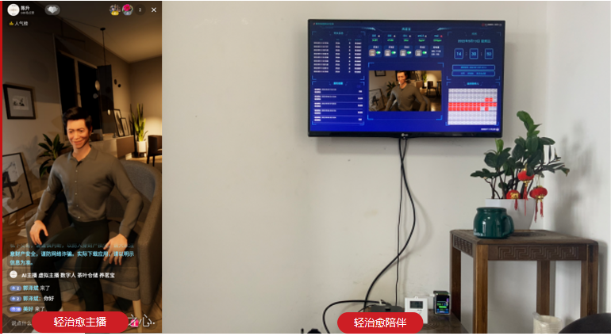
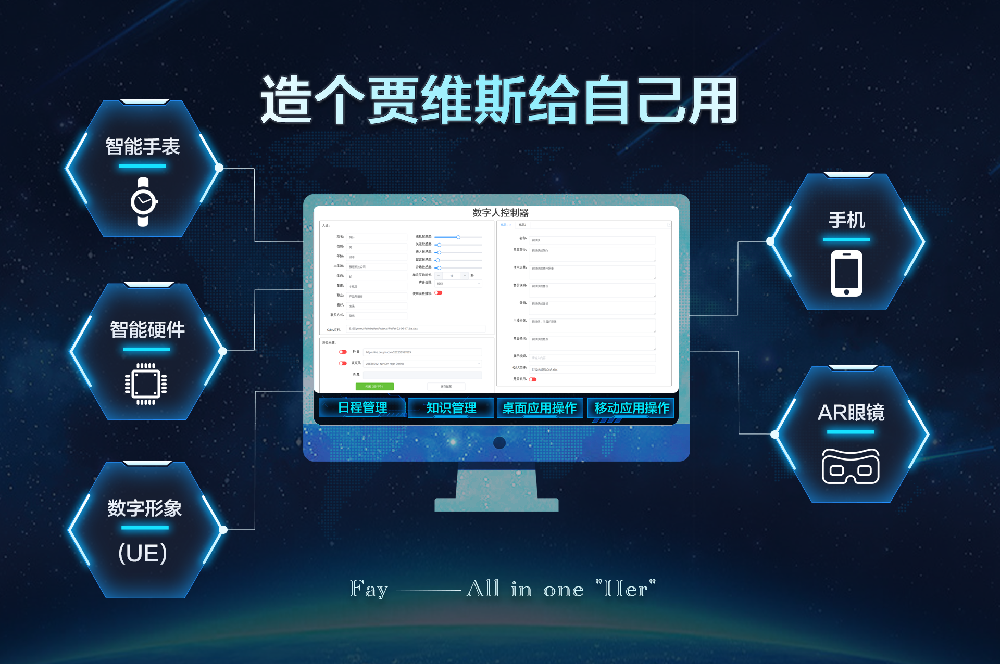

<div align="center">
    <br>
    
    <h1>FAY</h1>
	<h3>数  字  人  Fay  控  制  器(这是元宇宙吗？)</h3>
</div>


​		本开源项目名为“数字人控制器”。意为，本项目可以充当时下流行的虚拟人、虚拟主播、数字人，等仿人形数字形象的内核部分。

​		使用UE、C4D、DAZ、LIVE2D等三维引擎软件开发的数字形象可以与本“数字人控制器”对接，从而实现虚拟主播、数字导游、数字助手等。我们提供UE4对接的demo，但我们更鼓励用户自行实现喜欢的数字形象。

​		当然，若不考虑外观形象的话，本“数字人控制器”其实也可以独立使用的，可以充当一个语音助理。NLP可以自由切换AIUI、ChatGPT及Yuan1.0。



相关文章：

1、[(34条消息) 非常全面的数字人解决方案_郭泽斌之心的博客-CSDN博客_数字人算法](https://blog.csdn.net/aa84758481/article/details/124758727)

2、[(34条消息) Fay数字人开源项目在mac 上的安装办法_郭泽斌之心的博客-CSDN博客](https://blog.csdn.net/aa84758481/article/details/127551258)

3、【开源项目：数字人FAY——Fay新架构使用讲解】 https://www.bilibili.com/video/BV1NM411B7Ab/?share_source=copy_web&vd_source=64cd9062f5046acba398177b62bea9ad

4、【开源项目FAY——UE工程讲解】https://www.bilibili.com/video/BV1C8411P7Ac?vd_source=64cd9062f5046acba398177b62bea9ad

5、m1机器安装办法（Gason提供）：https://www.zhihu.com/question/437075754


目前最新版本是2.0。在新版本里我们提出一个全新的架构。在这个架构下每个人都可以把Fay控制器搭建在自己个人电脑上（未来，或许我们会提供终端），让你电脑成为你数字助理的载体。你的所有设备（手表、手机、眼镜、笔记本）随时可以与你的数字助理通讯，数字助理将通过电脑为你处理数字世界里的所有事情。（贾维斯？Her?）


2023.02：
1、提供chatgpt及yuan1.0作为选择。

2023.01：
1、控制器pc内网穿透，音频输入输出设备远程直连；
2、提供android 音频输入输出工程示例代码；
3、提供python音频输入输出工程示例代码（远程PC、树莓派等可用）；
4、补传1.0语音指令音乐播放模块（暂不支持远程播放）；
5、重构及补充若干工具模块：websocket、多线程、缓冲器、音频流录制器等；
6、修复1.x版本的多个bug；
7、集成看板娘;


2022.12：
1、上传bin目录（用于直播互动）；

2022.11：
1、更新抖音直播获取粉丝互动数据的xpath;

2022.10.27：
1、更新mac上的麦克风参数；
2、解决mac上无法重启问题；
3、上传brew安装脚本。

2022.10.17：
1、更新语音指令；
2、补充人设语法；

## 语音指令

- **关闭核心**
  关闭
  再见
  你走吧
- **静音**
  静音
  闭嘴
  我想静静
- **取消静音**
  取消静音
  你在哪呢？
  你可以说话了
- **播放歌曲（暂不能用需更换音乐库）**
  播放歌曲
  播放音乐
  唱首歌
  放首歌
  听音乐
  你会唱歌吗？
- **暂停播放**
  暂停播放
  别唱了
  我不想听了


## 环境

- Python 3.8.0 +

- Chrome 浏览器 (若不开启直播功能，可跳过)


## 安装

### 安装依赖

```shell
pip install -r requirements.txt
```


### 配置 ChromeDriver (若不开启直播功能，可跳过)

1. Chrome 浏览器进入 [`chrome://settings/help`](chrome://settings/help) 查看当前版本
2. 下载对应版本 [ChromeDriver](https://chromedriver.chromium.org/downloads) 
3. 解压zip并拷贝至 <u>./bin</u> 目录
4. 编辑 <u>system.conf</u> 配置 ChromeDriver 路径


### 配置应用密钥

1. 查看 [AI 模块](#ai-模块)

2. 浏览链接，注册并创建应用，将应用密钥填入 `./system.conf` 中


## 启动

启动数字人图像控制器

```shell
python main.py
```


## 图形界面


### 人设

数字人属性，与用户交互中能做出相应的响应。

##### 交互灵敏度

在交互中，数字人能感受用户的情感，并作出反应。最直的体现，就是语气的变化，如 开心/伤心/生气 等。

设置灵敏度，可改变用户情感对于数字人的影响程度。


### 接收来源

#### 抖音

填入直播间地址，实现与直播间粉丝交互


#### 麦克风

选择麦克风设备，实现面对面交互，成为你的伙伴


#### socket远程音频输入

可以接入远程音频输入，远程音频输出


#### 商品栏

填入商品介绍，数字人将自动讲解商品。

当用户对商品有疑问时，数字人可自动跳转至对应商品并解答问题。

配合抖音接收来源，实现直播间自动带货。


## AI 模块


启动前需填入应用密钥[`system.conf`](https://github.com/TheRamU/Fay/blob/main/system.conf)

| 代码模块                  | 描述                       | 链接                                                         |
| ------------------------- | -------------------------- | ------------------------------------------------------------ |
| ./ai_module/ali_nls.py    | 阿里云 实时语音识别        | https://ai.aliyun.com/nls/trans                              |
| ./ai_module/ms_tts_sdk.py | 微软 文本转语音 基于SDK    | https://azure.microsoft.com/zh-cn/services/cognitive-services/text-to-speech/ |
| ./ai_module/xf_ltp.py     | 讯飞 情感分析              | https://www.xfyun.cn/service/emotion-analysis                |
| ./utils/ngrok_util.py     | ngrok.cc 外网穿透（可选）  | http://ngrok.cc                                              |
| ./ai_module/yuan_1_0.py    | 浪潮源大模型（NLP 3选1）  | https://air.inspur.com/                                              |
| ./ai_module/chatgpt.py     | ChatGPT（NLP 3选1）  | *******                                              |
| ./ai_module/xf_aiui.py    | 讯飞自然语言处理（NLP 3选1）   | https://aiui.xfyun.cn/solution/webapi                        |


## 与远程音频输入输出设备连接（非必须,外网需要配置http://ngrok.cc ngrok tcp通道的clientid）

控制器与采用 socket(非websocket) 方式与 音频输出设备通讯

内网通讯地址: [`ws://127.0.0.1:10001`](ws://127.0.0.1:10001)

外网通讯地址: 通过http://ngrok.cc获取


消息格式: 参考 [remote_audio.py](https://github.com/TheRamU/Fay/blob/main/python_connector_demo/remote_audio.py)

## 与数字形象通讯（非必须,控制器需要关闭“面板播放”）

控制器与采用 WebSocket 方式与 UE 通讯

下载工程: [https://pan.baidu.com/s/1RBo2Pie6A5yTrCf1cn_Tuw?pwd=ck99](https://pan.baidu.com/s/1RBo2Pie6A5yTrCf1cn_Tuw?pwd=ck99)

下载工程: [https://pan.baidu.com/s/1CsJ647uV5rS2NjQH3QT0Iw?pwd=s9s8](https://pan.baidu.com/s/1CsJ647uV5rS2NjQH3QT0Iw?pwd=s9s8)

通讯地址: [`ws://127.0.0.1:10002`](ws://127.0.0.1:10002)（已接通）

消息格式: 查看 [WebSocket.md](https://github.com/TheRamU/Fay/blob/main/WebSocket.md)


## 目录结构

```
.
├── main.py					# 程序主入口
├── fay_booter.py			# 核心启动模块
├── config.json				# 控制器配置文件
├── system.conf				# 系统配置文件
├── ai_module
│   ├── ali_nls.py			# 阿里云 实时语音
│   ├── ms_tts_sdk.py       # 微软 文本转语音
│   ├── xf_aiui.py          # 讯飞 人机交互-自然语言处理
│   └── xf_ltp.py           # 讯飞 性感分析
├── bin                     # 可执行文件目录
├── core                    # 数字人核心
│   ├── fay_core.py         # 数字人核心模块
│   ├── recorder.py         # 录音器
│   ├── tts_voice.py        # 语音生源枚举
│   ├── viewer.py           # 抖音直播间接入模块
│   └── wsa_server.py       # WebSocket 服务端
├── gui                     # 图形界面
│   ├── flask_server.py     # Flask 服务端
│   ├── static
│   ├── templates
│   └── window.py           # 窗口模块
├── scheduler
│   └── thread_manager.py   # 调度管理器
└── utils                   # 工具模块
    ├── config_util.py      
    ├── storer.py
    └── util.py
```
进一步交流请联系QQ 467665317

技术交流群


